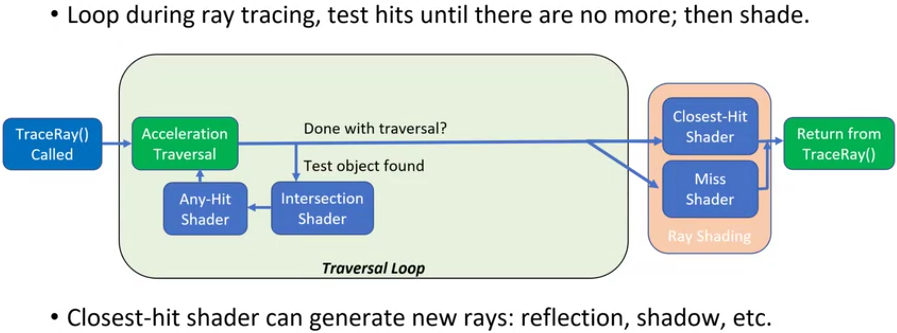
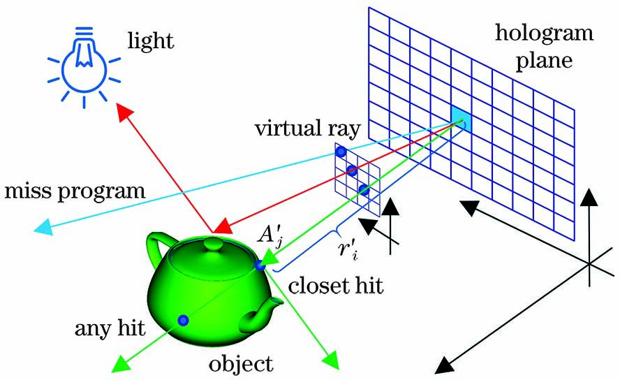

CUDA Path Tracer
================

**University of Pennsylvania, CIS 565: GPU Programming and Architecture, Project 3**

* Junwei Huang
* Tested on: Windows 10, i7-13790F @ 5.20GHz 32GB, RTX 4080 16.0GB

## What is Ray tracing?

Ray tracing is a rendering technique that simulates how light interacts with objects in a scene. Here's how it works:

1. For each pixel, a ray is traced from the camera into the scene
2. When the ray hits an object, it triggers the following process:
   - First, an "intersection test" checks where exactly the ray hit
   - Then, the "closest-hit shader" calculates what color that point should be
   - The shader can also generate new rays for effects like:
     - Reflection rays (bouncing off shiny surfaces)
     - Shadow rays (checking if a point is in shadow)
     - Other light effects

If a ray doesn't hit anything, a "miss shader" handles it (usually returning a background color).

This process creates realistic lighting effects by actually following the paths that light would take in the real world, including reflections, shadows, and indirect lighting.
